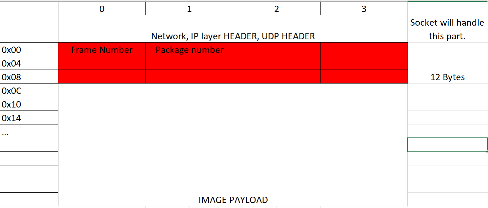
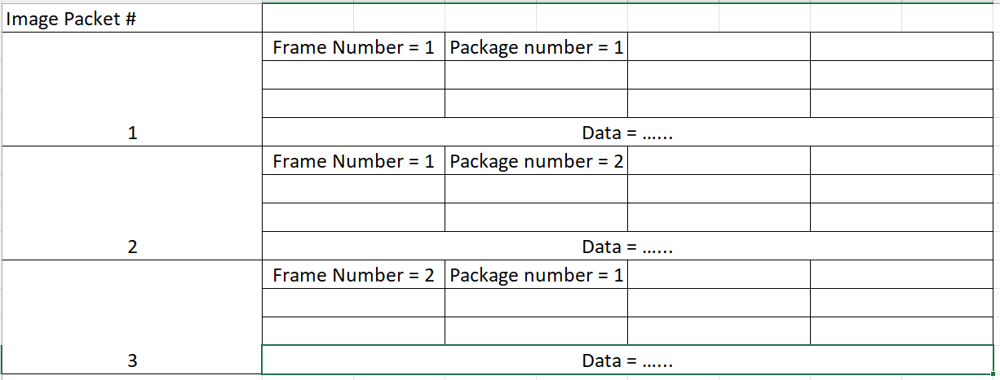

## Intro 
This documentation defines the format of a UDP packet for our image transmition. We call such packet Image Packet. 

## UDP packet Image format:

{width="6.925in"
height="2.9583333333333335in"}

Let's define our image over UDP packet as **"Image Packet"** for
convenience.

Each Image Packet's first 12 bytes are used as control bits.

\[0\] byte is used to indicate the frame number

\[1\] byte is used to indicate the package number, i.e. for this frame,
this packet is the n-th packet. This is helpful when need to handle
out-of-order reception and lost packet.

\[2-11\] bytes are reserved for future.

-   A frame (an image) usually contains more than 1 Image package. For
    example, if an image is 160,000 Bytes, and an Image Packet is
    defined as 63,000 Bytes long, then a frame will need 3 Image Packet
    to transmit. Therefore, we need each Image Packet to have a frame
    number and a packet number.

-   UDP is not delivery guaranteed. If a frame is incomplete, need some
    method to handle the problem.

## An example of stream of Image Packet will be:

{width="6.191515748031496in"
height="2.3581408573928258in"}

Then it is necessary to append Packet 1 and Packet 2 to construct frame
1.

## Side notes about future changes:

1.  About the frame and packet size. Right now this test program is
    working on raw image (160, 000 bytes), and each Image Packet has
    pre-defined size. This will not be the case for the future. We may
    move into variable-sized Packet.

2.  Reserved headers will be used.

3.  
